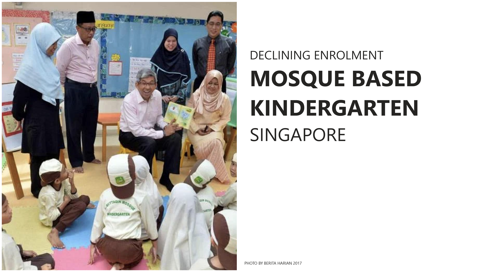

##### Capstone: POWERBI INTERACTIVE DASHBOARD
---
---
# DECLINING ENROLMENT - MOSQUE-BASED KINDERGARTEN SINGAPORE

---
---
#### Dashboard
Go to [Power BI](https://github.com/muhdkhairiboyani/capstone_declining-enrolment-mosque-based-kindergarten-SG/blob/main/Analysis%20of%20MBK%20Singapore_v2.pbix) \
Go to [PDF](https://github.com/muhdkhairiboyani/capstone_declining-enrolment-mosque-based-kindergarten-SG/blob/main/Analysis%20of%20MBK%20Singapore_v2.pdf)

#### Dataset source:
**Source 01** \
Title: Listing of Centres Incidental Charges \
This data set contains the incidental charges set by the pre-school centres. \
Coverage: March 29, 2019 to April 23, 2023 \
Last updated: April 24, 2023 \
Licence: Singapore Open Data Licence \
Format: CSV \
Link: [Listing of Centres Incidental Charges](https://data.gov.sg/dataset/listing-of-centres-incidental-charges)

**Source 02** \
Title: Listing of Centres Licence History \
This data set contains the licence history set by the pre-school centres. \
Coverage: March 9, 2020 to April 23, 2023 \
Last updated: April 24, 2023, 12:00 (SGT) \
Licence: Singapore Open Data Licence \
Format: CSV \
Link: [Listing of Centres Licence History](https://data.gov.sg/dataset/listing-of-centres-licence-history)

**Source 03** \
Title: Listing of Centres \
This data set contains a listing of all active pre-school centres. \
Coverage: November 20, 2018 to April 23, 2023 \
Last updated: April 24, 2023, 11:45 (SGT) \
Licence: Singapore Open Data Licence \
Format: CSV \
Link: [Listing of Centres](https://data.gov.sg/dataset/listing-of-centres)

**Source 04** \
Title: Listing of Centre Services \
This data set contains the listing of services provided by pre-school centres. \
Coverage: November 20, 2018 to April 23, 2023 \
Last updated: April 24, 2023, 11:44 (SGT) \
Licence: Singapore Open Data Licence \
Format: CSV \
Link: [Listing of Centre Services](https://data.gov.sg/dataset/listing-of-centre-services)

#### Description of Capstone
In 2017, Straits Times published a report "[Muis, Mendaki looking into sprucing up mosque-based kindergartens](https://www.straitstimes.com/singapore/muis-mendaki-looking-into-sprucing-up-mosque-based-kindergartens)". Since then, not much has been reported on how far all mosque-based kindergarten has progressed in areas of professionalism and to be recognised as learning centres in Singapore.

I identified the following possible questions for this capstone:
- GROUPING OF CENTRES: Distance between centres within its district
- SCHOOL FEES & MATERIAL FEES: Are school fees standardized?
- LANGUAGE AS KEY INFLUENCER: Does teaching 'Arabic' language raise a centre's fee?
- AWARENESS: Has all centre attain any form of certification?

## INSIGHTS
To increase enrolment and ease of choosing a centre within a district: 

CENTRE GROUPING:
Centres in the NORTH district could be separated into 2 groups:
- NORTH Group 1 consists of An-Nur and Darul Makmur - Nearer to each other.
- NORTH Group 2 consists of Al Muttaqin, Istiqamah and En-Naeem - Nearer to each other.

WEST and SOUTH centres could be separated into their own districts for enrolment.

SCHOOL FEES AND MATERIAL FEES: \
ALL centres could aim to standardize School fees and Material fees within their District. This will help with future enrolment exercises especially for centre transfer or placement within a district 

CERTIFICATION \
From 2017 to 2023 (6 years), only Al Khair Centre is SPARK certified. Centre principals or main body that oversee all centre should look into SPARK certification for the other 14 centres in the near future.

**WAYS TO IMPROVE INSIGHTS** \
Attaining the following data will help improve the above insights to increase enrolment:
- Enrolment data
- Curriculum Framework
- Social Media Presence

---

#### Contact me
- LinkedIn: [Muhammad Khairi](www.linkedin.com/in/muhammd-khairi-boyani-10694061)
- Instagram: [mikistudio21](https://www.instagram.com/mikistudio21/)

---
#### Platforms:
- Microsoft Power BI
- Microsoft Excel
- Markdown: [dillinger](https://dillinger.io)

---
#### Photo:
- Berita Harian

---
